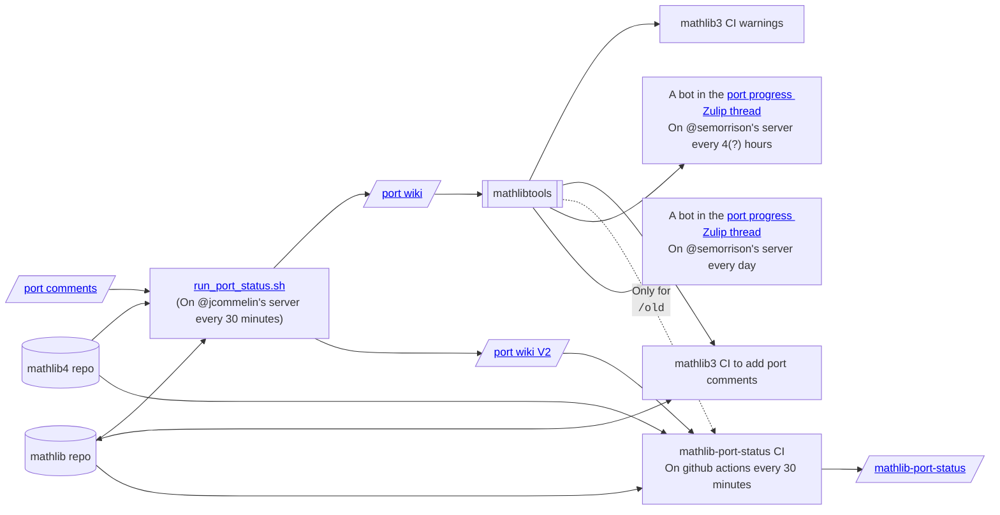

# mathlib-port-status
Tools for managing the status of the port, notably [the web dashboard](https://leanprover-community.github.io/mathlib-port-status/).

## Architecture



## Using the github api

When getting an error "API rate limit exceeded for ...", you can [get a token](https://github.com/settings/tokens)
and then
```bash
export GITHUB_TOKEN=$(cat path/to/my/github-token)
```
before running `make_html.py`.
